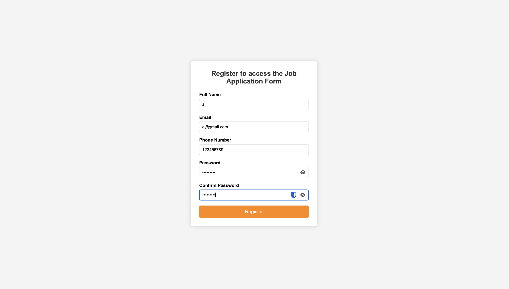
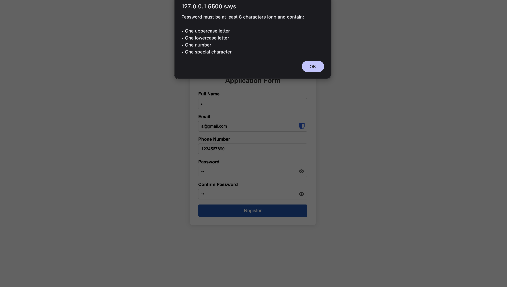
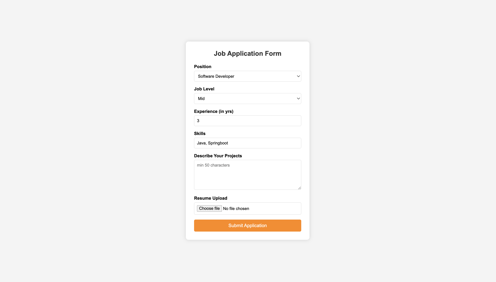

# Week 02 – Online Job Application Portal

## 1. Exercise
Design and implement a client-side multi-step form validation system for an Online Job Application Portal using HTML, CSS, JavaScript, and Font Awesome icons. The application should begin with a User Registration Form. After successful validation of all registration fields, the user should be allowed to proceed to the Job Application Form. Upon successful validation of the job application details, an application submission success message should be displayed.

## 2. Concepts
• Multi-step forms
• Client-side validation using JavaScript
• DOM Manipulation
• Event handling

## 3. Project Structure

```text
2_job_application/
├── register.html       # User Registration Form layout
├── register.js         # Validation logic for registration
├── application.html    # Job Application Form layout
├── application.js      # Validation logic for application
├── style.css           # Contains the styling
└── assets/             # Assets and Font Awesome configurations
```

## 4. Screenshots


