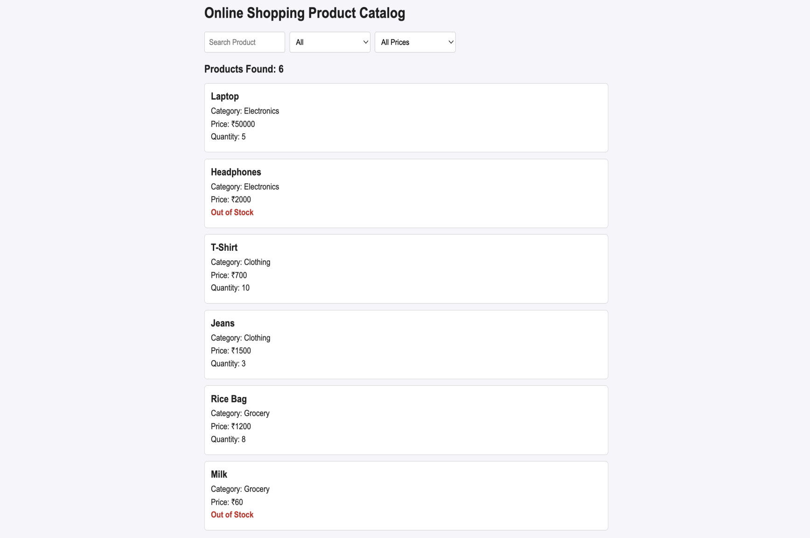
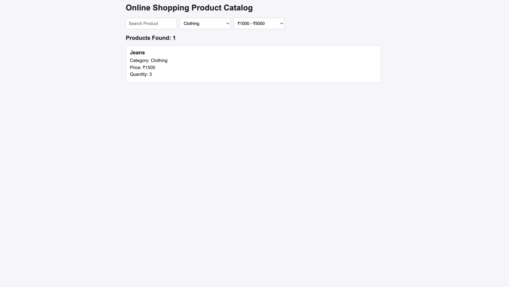

# Week 04 – React-based Online Shopping Product Catalog

## 1. Exercise
Aim: To develop a React-based Online Shopping Product Catalog that demonstrates dynamic searching, filtering, and conditional rendering using React state management. Features: Search products by name. Filter by category (Electronics, Clothing, Grocery). Filter by price range. Show "Out of Stock" if quantity is 0. Display product count. 

## 2. Concepts
• useState
• Multiple filters
• filter() and map() array methods
• Conditional rendering

## 3. Project Structure

```text
4_shop_catalog/
├── index.html          # Main HTML entry point
├── app.js              # Application logic
├── style.css           # Component and layout styling
├── src/                # React source files and components
└── assets/             # Static assets like images
```

## 4. Screenshots

