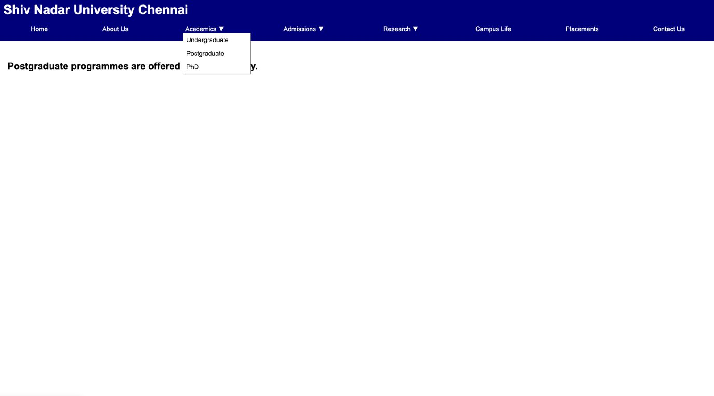
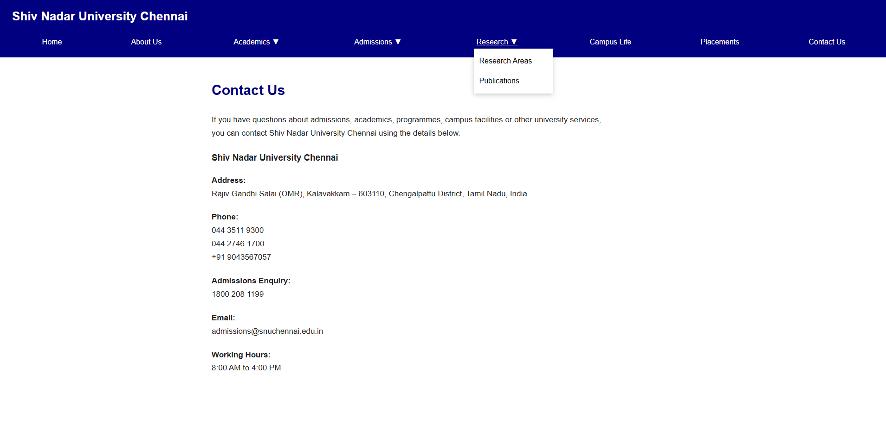

# Week 05 – React.js-based Menu Navigation System

## 1. Exercise
Design and implement a React.js-based menu navigation system for a university website containing menus such as About Us, Academics, Admissions, Research, Campus Life, Placements, and Contact Us. Implement dropdown menus for relevant sections and use React components, props, JSX, event handling, and React Router to provide smooth navigation between pages.

## 2. Concepts
• React components, props, and JSX
• Event handling in React
• React Router for navigation
• Dropdown menu implementation

## 3. Project Structure

```text
5_university-menu/
├── index.html          # Main HTML entry point
├── package.json        # Dependencies and scripts
├── vite.config.js      # Vite configuration
├── src/                # React components and routing logic
├── public/             # Public assets
└── assets/             # Additional static assets
```

## 4. Screenshots


