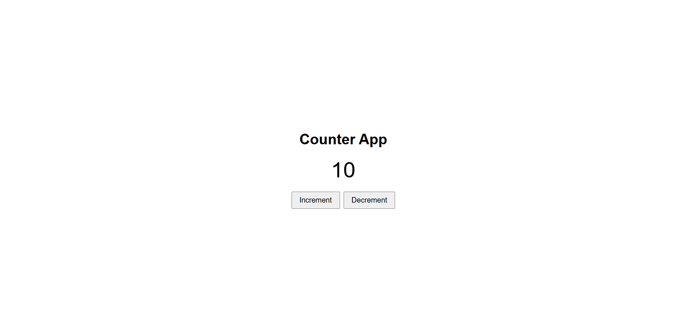

# Week 06 – React.js-based Counter Application

## 1. Exercise
Design and implement a simple React.js-based counter application that allows users to increment and decrement a counter value. Use React components, JSX, state management with `useState`, event handling, and CSS styling to create a centered and interactive user interface.

## 2. Concepts
• React components and JSX  
• State management using `useState`  
• Event handling in React  
• Component-based architecture  
• CSS styling and screen centering  

## 3. Project Structure

```text
6_counter/
├── index.html          # Main HTML entry point
├── package.json        # Dependencies and scripts
├── src/                # React components and styling
│   ├── App.jsx         # Main React component
│   ├── main.jsx        # React application entry point
│   └── index.css       # Application styling
└── public/             # Public assets
```

## 4. Screenshots

