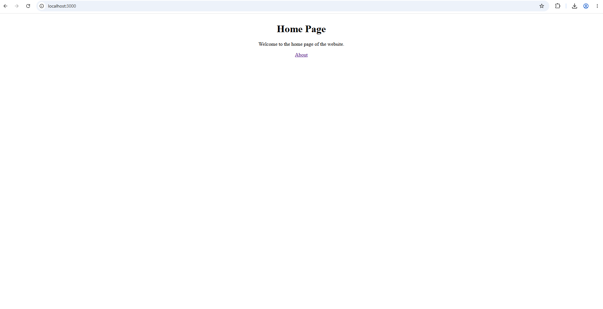
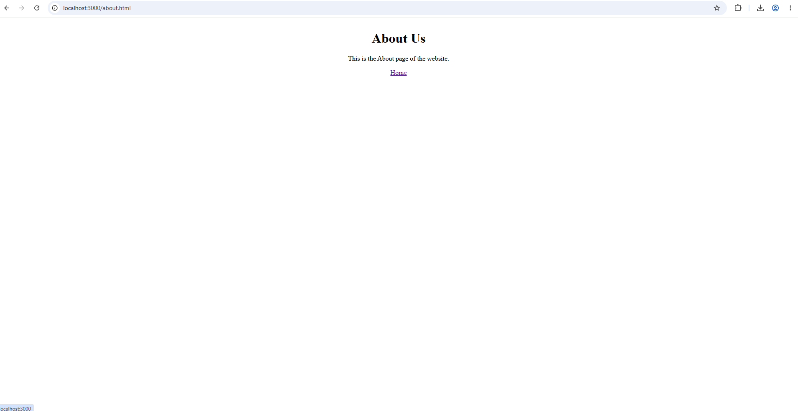

# Week 07 – Node.js Web Server with Routing and Middleware

## 1. Exercise
Design and implement a simple Node.js web server using the built-in `http`, `fs`, and `path` modules. The server provides Home and About pages, handles invalid routes using a 404 status code, and uses middleware to log incoming requests and response status codes to the console.

## 2. Concepts
• Node.js HTTP server  
• Routing using request URLs  
• File handling using `fs`  
• Path handling using `path`  
• Middleware for request logging  
• HTTP status codes and error handling  
• Content type handling  

## 3. Project Structure

```text
nodejs-web-server/
├── server.js           # Node.js HTTP server
└── public/
    ├── index.html      # Home page
    └── about.html      # About page
```

## 4. Screenshots



